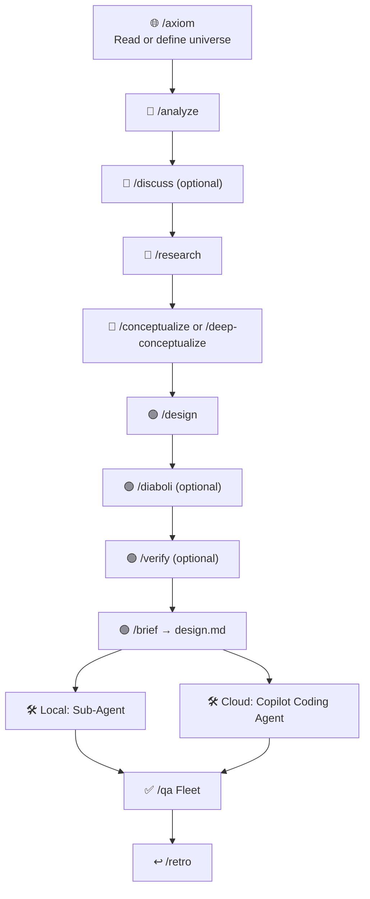

# Agentic Workflow for GitHub Copilot

**A skills-based workflow template for structured, AI-supported software development.**

> Language-agnostic. Optimized for GitHub Copilot. Copy, run `/axiom`, get started.

---

## The Core Principle

> *“If you wish to make an apple pie from scratch, you must first invent the universe."*
> — Carl Sagan

Before an agent can work meaningfully, it needs a **universe** — a precise model of the application, its constraints, and its stack. Undefined universe in — undefined output out.

This workflow makes defining the universe the first conscious step. Everything else then follows in four colors:

```
  ┌──────────────────────────────────────────────────────────────┐
  │  Phase 0: UNIVERSE  — /axiom  (starts every task)          │
  │  Reads or defines: architecture · stack · constraints     │
  └──────────────────────────────────────────────────────────────┘
         │
         ▼ per task:
  🔴 RED  — Problem space     /analyze /discuss /research
  🔵 BLUE — Solution options /conceptualize
  🟢 GREEN — Solution design   /design /diaboli /verify → /brief → design.md
         │
         ▼
      BUILD → QA → LEARNING
```

**Red** is the red spot — “this is exactly where the problem is.” **Blue** are raw solution options that together cover the red spot. **Green** is the one chosen solution tailored to the universe — `design.md`. And then: “Build me **exactly that**.”

---

## The Workflow (Phases 0–6)



### Phase 0: Universe (`/axiom`)

**Every task begins with `/axiom`.** The Skill reads `docs/project.md` + `docs/architecture.md` — if a universe is already there: great, context is set, continue. If nothing is there or it is incomplete: Socratic dialogue about stack, constraints, NFAs, out-of-scope — the result is written to `docs/`.

The universe belongs to the project, not the task. `/axiom` writes it, `/retro` improves the workflow, but the universe only changes when the stack or constraints fundamentally change.

> **If the universe is not well defined:** The agent proposes solutions that collide with the actual constraints. The error only becomes visible during implementation — an expensive correction loop.

### Phase 1: Red — Problem Space

**`/analyze`** makes the red spot precise. Which concrete problem should be solved? Which components are affected?

**`/research`** *(built-in)* fills knowledge gaps with external context.

**`/discuss`** *(optional)* clarifies gray areas and assumptions before conceptualization.

### Phase 2: Blue — Solution Options

**`/conceptualize`** shows raw solution options. Condition: together, all options cover the entire red spot. The user chooses which options to pursue further.

**`/deep-conceptualize`** *(Alternative)* — several options are analyzed in parallel by separate agents, and a meta-agent synthesizes the result.

### Phase 3: Green — Solution Design

**`/design`** details the approved options as ADRs + pseudocode. Every decision needs a source. The result is a collaborative artifact — not finished code, but discussion material that is iterated on together.

**`/diaboli`** *(optional)* attacks the decisions as Devil's Advocate.

**`/verify`** *(optional)* performs the completeness check.

**`/brief`** always generates `design.md` — the green figure, the only handoff artifact to Phase 4. Three paths: local (design.md → Sub-Agent), cloud (design.md → Copilot Coding Agent), existing issue (becomes the green figure).

### Phase 4: Build

`design.md` → Sub-Agent (local) or GitHub Issue (Copilot Coding Agent, Cloud).

### Phase 5: QA

**`/qa`** dispatches all 5 reviews in parallel as a Fleet:

| Skill | Checks |
|-------|--------|
| `/simplify` | Unnecessary complexity |
| `/test-review` | Test coverage (mathematical, with matrix) |
| `/review` | *(built-in)* Bugs, logic, patterns |
| `/sec-review` | Injection, auth, secrets, OWASP |
| `/doc-review` | Docs vs. code consistency |

After every review: discuss findings and fix them.

### Phase 6: Learning

**`/retro`** improves the **workflow** (rules, Skills) — not the universe. The universe is only changed through `/axiom`.

**`/upstream`** transfers generic Skill improvements from the retrospective back to the original Skill repo as a PR — other projects benefit.

**`/downstream`** pulls the latest version of the Skills from the Skill repo. Local adjustments stay intact.

---

## Skills at a Glance

| Skill | Phase | Purpose |
|-------|-------|---------|
| `/axiom` | 0 — Universe | Socratic dialogue + codebase analysis → `docs/` |
| `/analyze` | 1 — Red | Open up the problem space, red spot |
| `/research` | 1 — Red | *(Built-in)* Fill knowledge gaps |
| `/discuss` | 1 — Red | Clarify gray areas + user preferences |
| `/conceptualize` | 2 — Blue | Show solution options, checkpoint |
| `/deep-conceptualize` | 2 — Blue | Multi-Agent concept exploration (alternative) |
| `/design` | 3 — Green | ADRs + pseudocode as a collaborative artifact |
| `/diaboli` | 3 — Green | Devil's Advocate (optional) |
| `/verify` | 3 — Green | Completeness check (optional) |
| `/brief` | 3 → 4 | Generates `design.md` — the green figure |
| `/simplify` | 5 — QA | Simplify code |
| `/test-review` | 5 — QA | Test coverage (mathematical, with matrix) |
| `/review` | 5 — QA | *(Built-in)* Code review |
| `/sec-review` | 5 — QA | Security review |
| `/doc-review` | 5 — QA | Documentation review |
| `/qa` | 5 — QA | Meta-Skill: all 5 reviews in parallel |
| `/retro` | 6 — Learning | Improve the workflow |
| `/upstream` | 6 — Learning | Send improvements back to the Skill repo |
| `/downstream` | Setup | Pull the latest Skills |
| `/next` | Workflow | Read plan.md, start the next Skill |

---

## Setup

### 1. Copy `.github/`

```bash
cp -r .github/ /path/to/your/project/.github/
```

That is all you need. All workflow rules, Skills, and instructions live in `.github/` — nothing else is required.

### 2. Define the universe

```
/axiom
```

The Skill guides you through a Socratic dialogue: stack, architecture, constraints, NFAs, out-of-scope. The result is stored in `docs/` (project.md, architecture.md, domain.md) — readable by any agent tool.

### 3. Get started

```
/analyze "I want to build feature X"
/next
```

With `/next`, you can start the next step at any time — the Skill reads the workflow state from `plan.md`.

---

## The Most Important Rules

The full rules are in `.github/instructions/agents.instructions.md`. The most important ones:

| # | Rule |
|---|------|
| 1 | **Minimum workflow**: Phase 1 → Phase 3 + /brief → Phase 4 → Phase 5 → Phase 6 |
| 2 | **Delegate**: Main Agent = manager. All tasks → Sub-Agents with fresh context windows |
| 3 | **Plan mode**: Plan first, then implement after approval |
| 4 | **No commit without approval**: Only if the user explicitly says "commit" or "push" |
| 13 | **Fact-based**: No assumptions — provide a source or ask |
| 18 | **No placeholders**: "TBD", "TODO", "details to follow" are forbidden |
| 28 | **Output format**: Pure info → Plain HTML. Interaction needed → disposable web app (HTML + JS, autosave to localStorage, export via clipboard) |

---

## File Structure

```
.github/                                     # Template (copy)
├── copilot-instructions.md              # Language, doc convention, reference to agents.instructions.md
├── instructions/
│   └── agents.instructions.md          # Workflow rules, Skill overview (loaded as agent/chat context)
└── skills/
    ├── axiom/SKILL.md                   # Defines the universe (Phase 0)
    ├── analyze/SKILL.md
    ├── discuss/SKILL.md
    ├── conceptualize/SKILL.md
    ├── deep-conceptualize/SKILL.md
    ├── design/SKILL.md
    ├── diaboli/SKILL.md
    ├── verify/SKILL.md
    ├── brief/SKILL.md                   # Generates design.md (green figure)
    ├── simplify/SKILL.md
    ├── test-review/SKILL.md
    ├── sec-review/SKILL.md
    ├── doc-review/SKILL.md
    ├── qa/SKILL.md
    ├── retro/SKILL.md
    ├── upstream/SKILL.md
    ├── downstream/SKILL.md
    └── next/SKILL.md

# Created by /axiom (in the target project):
docs/
├── project.md                           # Vision, Goals, Constraints, NFAs, Scope
├── architecture.md                      # Stack, components, patterns, folders
├── domain.md                            # Domain terms, business rules, glossary
└── decisions/                           # ADRs (filled by /design)
    └── 0001-*.md
```

---

## Keep Skills Up to Date

```
Skill repo (original)
    ↕ /upstream (contribute improvements)
    ↕ /downstream (pull latest version)
Consumer repo (project)
```

> **Tip:** `/downstream` at the start of a new workflow cycle, `/upstream` after `/retro`.

---

## 🤝 Contribute Back — Share Your Improvements

This template is meant to **evolve through use**. If you sharpen a rule, improve a Skill prompt, or build a new Skill that fills a real gap in the workflow: **share it back**.

The workflow ships with a Skill made exactly for this — **`/upstream`**:

1. Run `/retro` after a workflow cycle to capture what worked and what didn't.
2. Run `/upstream` to package your improvements into a clean PR against this repo.
3. Open the PR — even a single sharpened rule or a typo fix is welcome.

**What we love to see:**
- 🔧 **Sharper rules** — when a rule misfired or had a blind spot in real use
- 🧩 **New Skills** — when a recurring need has no Skill yet
- 🪄 **Better Skill prompts** — clearer instructions, better outputs, fewer placeholders
- 🌐 **Harness adapters** — making the workflow run cleanly on Cursor, Claude Code, Aider, …
- 📚 **Docs & examples** — real-world experience reports help everyone

The workflow gets more precise with every cycle — and every contribution makes it more precise for the next person, too. **No improvement is too small.** See [`CONTRIBUTING.md`](CONTRIBUTING.md) for the details.

---

## License

MIT
