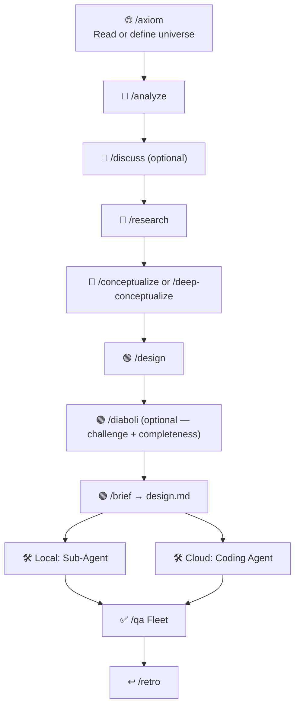

# Agentic Workflow

**A skills-based workflow template for structured, AI-supported software development.**

> Language-agnostic. Works with GitHub Copilot CLI and Claude Code. Run `/install-workflow <target>` from this repo to deploy.

---

## The Core Principle

> *"If you wish to make an apple pie from scratch, you must first invent the universe."*
> — Carl Sagan

Before an agent can work meaningfully, it needs a **universe** — a precise model of the application, its constraints, and its stack. Undefined universe in — undefined output out.

This workflow makes defining the universe the first conscious step. Everything else then follows in four colors:

```
  ┌──────────────────────────────────────────────────────────────┐
  │  Phase 0: UNIVERSE  — /axiom  (starts every task)          │
  │  Reads or defines: architecture · stack · constraints     │
  └──────────────────────────────────────────────────────────────┘
         │
         ▼ per task:
  🔴 RED  — Problem space     /analyze /discuss /research
  🔵 BLUE — Solution options /conceptualize
  🟢 GREEN — Solution design   /design /diaboli → /brief → design.md
         │
         ▼
      BUILD → QA → LEARNING
```

**Red** is the red spot — "this is exactly where the problem is." **Blue** are raw solution options that together cover the red spot. **Green** is the one chosen solution tailored to the universe — `design.md`. And then: "Build me **exactly that**."

---

## The Workflow (Phases 0–6)



### Phase 0: Universe (`/axiom`)

**Every task begins with `/axiom`.** The Skill reads `docs/project.md` + `docs/architecture.md` — if a universe is already there: great, context is set, continue. If nothing is there or it is incomplete: Socratic dialogue about stack, constraints, NFAs, out-of-scope — the result is written to `docs/`.

The universe belongs to the project, not the task. `/axiom` writes it, `/retro` improves the workflow, but the universe only changes when the stack or constraints fundamentally change.

> **If the universe is not well defined:** The agent proposes solutions that collide with the actual constraints. The error only becomes visible during implementation — an expensive correction loop.

### Phase 1: Red — Problem Space

**`/analyze`** makes the red spot precise. Which concrete problem should be solved? Which components are affected?

**`/research`** fills knowledge gaps with external context. On Copilot CLI this is a built-in agent; on Claude Code a custom Skill is shipped (uses WebSearch + Explore + `gh search`).

**`/discuss`** *(optional)* clarifies gray areas and assumptions before conceptualization.

### Phase 2: Blue — Solution Options

**`/conceptualize`** shows raw solution options. Condition: together, all options cover the entire red spot. The user chooses which options to pursue further.

**`/deep-conceptualize`** *(alternative)* — several options are analyzed in parallel by separate agents, and a meta-agent synthesizes the result.

### Phase 3: Green — Solution Design

**`/design`** details the approved options as ADRs + pseudocode. Every decision needs a source. The result is a collaborative artifact — not finished code, but discussion material that is iterated on together.

**`/diaboli`** *(optional)* serves a dual role for high-complexity / high-risk designs: **Devil's Advocate** (creatively attacks the design from 5 angles) AND **completeness check** (verifies the design is ready for implementation against 6 mechanical dimensions). One Skill, two parts.

**`/brief`** always generates `design.md` — the green figure, the only handoff artifact to Phase 4. Three paths: local (design.md → Sub-Agent), cloud (design.md → cloud coding agent), existing issue (becomes the green figure).

### Phase 4: Build

`design.md` → Sub-Agent (local) or GitHub Issue (cloud coding agent).

### Phase 5: QA

**`/qa`** dispatches all 5 review dimensions in parallel as a Fleet:

| Dimension | Workflow Skill | Built-in equivalent used |
|-------|--------|--------------------------|
| Simplification | `/simplify` (Copilot) | Claude's `/simplify` |
| Test coverage (mathematical) | `/test-review` | — (custom on both) |
| Code review | `/review` (Copilot built-in) | Claude's `/code-review` |
| Security | `/security-review` (Copilot) | Claude's `/security-review` (built-in) |
| Docs vs. code | `/doc-review` | — (custom on both) |

After every review: discuss findings and fix them. `/qa` itself stays on subscription budget; if you want deep cloud review, run `/code-review ultra` manually outside the workflow.

### Phase 6: Learning

**`/retro`** improves the **workflow** (rules, Skills) — not the universe. The universe is only changed through `/axiom`.

**`/upstream`** transfers generic Skill improvements from the retrospective back to this repo as a PR — other projects benefit.

**`/downstream`** pulls the latest version of the Skills from this repo into your project. Local adjustments are diffed against canonical; you decide per Skill.

---

## Skills at a Glance

| Skill | Phase | Purpose |
|-------|-------|---------|
| `/axiom` | 0 — Universe | Socratic dialogue + codebase analysis → `docs/` |
| `/analyze` | 1 — Red | Open up the problem space, red spot |
| `/research` | 1 — Red | Fill knowledge gaps (Copilot: built-in; Claude: shipped Skill) |
| `/discuss` | 1 — Red | Clarify gray areas + user preferences |
| `/conceptualize` | 2 — Blue | Show solution options, checkpoint |
| `/deep-conceptualize` | 2 — Blue | Multi-Agent concept exploration (alternative) |
| `/design` | 3 — Green | ADRs + pseudocode as a collaborative artifact |
| `/diaboli` | 3 — Green | Devil's Advocate + completeness check (optional) |
| `/brief` | 3 → 4 | Generates `design.md` — the green figure |
| `/simplify` | 5 — QA | Simplify code (Copilot only; Claude uses built-in) |
| `/test-review` | 5 — QA | Test coverage (mathematical, with matrix) |
| `/review` | 5 — QA | *(Built-in on both harnesses)* Code review |
| `/security-review` | 5 — QA | Security review, mandatory STRIDE (Copilot only; Claude uses its built-in) |
| `/doc-review` | 5 — QA | Documentation review |
| `/qa` | 5 — QA | Meta-Skill: all 5 review dimensions in parallel |
| `/retro` | 6 — Learning | Improve the workflow |
| `/upstream` | 6 — Learning | Send improvements back to the Skill repo |
| `/downstream` | Setup | Pull the latest Skills |
| `/next` | Workflow | Read plan.md, start the next Skill |
| `/install-workflow` | Setup (this repo only) | Install agentic-workflow into a target project |

---

## Setup

This repo distributes the methodology — it does not apply itself. To use the workflow in your own project:

### 1. Clone this repo locally

```bash
git clone https://github.com/pesteph/agentic-workflow.git ~/tools/agentic-workflow
```

### 2. Open this repo in your harness

GitHub Copilot CLI or Claude Code — `/install-workflow` is registered for both.

### 3. Run `/install-workflow` against your target project

```
/install-workflow /path/to/your/project
```

Optional: `--harness=copilot|claude|both` (default `both`).

`/install-workflow` detects which harness(es) you're using, installs the right files in your target, and handles both:

- **First install** — fresh setup, no existing methodology in target
- **Upgrade** — existing install gets updated; locally modified Skills get diffed and you decide per Skill

After `/install-workflow`, open your target project and run:

```
/axiom
```

`/axiom` defines the universe (project, architecture, domain). Then `/analyze` to start your first task.

### Harness coverage

- **GitHub Copilot CLI** — installs to `.github/skills/`; uses Copilot's `/research` and `/review` built-ins
- **Claude Code** — installs to `.claude/skills/`; uses Claude's `/code-review`, `/security-review`, `/simplify` built-ins; ships a custom `/research` Skill (no Claude built-in)

Skills with harness equivalents are intentionally NOT installed (skip-list in `.github/skills/install-workflow/SKILL.md`).

---

## File structure

### This repo (distribution)

```
agentic-workflow/
├── AGENTS.md                       # canonical workflow rules
├── skills/                         # canonical Workflow Skills (18)
│   ├── axiom/SKILL.md
│   ├── analyze/SKILL.md
│   ├── … 16 more
│   └── (no verify — merged into diaboli)
├── harnesses/                      # per-harness templates that /install-workflow copies
│   ├── copilot/
│   │   └── copilot-instructions.md
│   └── claude/
│       ├── CLAUDE.md
│       └── settings.json
├── .github/                        # this repo's own Copilot setup
│   ├── copilot-instructions.md     # minimal: "this repo provides /install-workflow"
│   └── skills/install-workflow/SKILL.md        # /install-workflow exposed for Copilot CLI
└── .claude/                        # this repo's own Claude setup
    ├── CLAUDE.md                   # minimal: "this repo provides /install-workflow"
    └── skills/install-workflow/SKILL.md        # /install-workflow exposed for Claude Code
```

### Your project (after `/install-workflow`)

```
your-project/
├── AGENTS.md                       # workflow rules at root
├── .github/                        # if Copilot:
│   ├── copilot-instructions.md
│   └── skills/<name>/SKILL.md ×17  (research, review skipped — Copilot built-ins)
├── CLAUDE.md                       # if Claude:
├── .claude/
│   ├── settings.json
│   └── skills/<name>/SKILL.md ×16  (review, security-review, simplify skipped — Claude built-ins)
├── docs/                           # created by /axiom — project universe
│   ├── project.md
│   ├── architecture.md
│   └── domain.md
└── plan.md                         # workflow state
```

---

## Keeping Skills Up to Date

From inside your target project:

```
/downstream    # pull latest Skills from this repo, with diff review per file
/upstream      # push your improvements back as a PR
```

These work in the target, not in this distribution repo.

> **Tip:** `/downstream` at the start of a new workflow cycle, `/upstream` after `/retro`.

---

## The Most Important Rules

The full rules are in [`AGENTS.md`](AGENTS.md). The most important ones:

| # | Rule |
|---|------|
| 1 | **Minimum workflow**: Phase 0 → Phase 1 → Phase 3 + /brief → Phase 4 → Phase 5 → Phase 6 |
| 2 | **Delegate**: Main Agent = manager. All tasks → Sub-Agents with fresh context windows |
| 3 | **Plan mode**: Plan first, then implement after approval |
| 4 | **No commit without approval**: Only if the user explicitly says "commit" or "push" |
| 13 | **Fact-based**: No assumptions — provide a source or ask |
| 18 | **No placeholders**: "TBD", "TODO", "details to follow" are forbidden |
| 28 | **Output format**: Pure info → Plain HTML. Interaction needed → disposable web app (HTML + JS, autosave to localStorage, export via clipboard) |

---

## 🤝 Contribute Back — Share Your Improvements

This template is meant to **evolve through use**. If you sharpen a rule, improve a Skill prompt, or build a new Skill that fills a real gap in the workflow: **share it back**.

The workflow ships with a Skill made exactly for this — **`/upstream`**:

1. Run `/retro` after a workflow cycle to capture what worked and what didn't.
2. Run `/upstream` to package your improvements into a clean PR against this repo.
3. Open the PR — even a single sharpened rule or a typo fix is welcome.

**What we love to see:**
- 🔧 **Sharper rules** — when a rule misfired or had a blind spot in real use
- 🧩 **New Skills** — when a recurring need has no Skill yet
- 🪄 **Better Skill prompts** — clearer instructions, better outputs, fewer placeholders
- 🌐 **Harness adapters** — making the workflow run cleanly on Cursor, Aider, …
- 📚 **Docs & examples** — real-world experience reports help everyone

The workflow gets more precise with every cycle — and every contribution makes it more precise for the next person, too. **No improvement is too small.** See [`CONTRIBUTING.md`](CONTRIBUTING.md) for the details.

---

## 💬 Feedback & Discussions

You don't have to open a PR to share your experience. **[GitHub Discussions](https://github.com/pesteph/agentic-workflow/discussions)** is the right place for:

- 🙋 **Questions** — something unclear in a Skill, a rule, or the setup
- 💡 **Ideas** — a new Skill concept, a better output format, a rule you'd challenge
- 🌟 **Show & tell** — how you use the workflow, what surprised you, what worked well
- 🐛 **Something broke** — a Skill prompt that misfired in practice

Every piece of real-world feedback sharpens the workflow for everyone. **You don't have to have a fix ready — just describe what happened.**

---

## License

MIT
